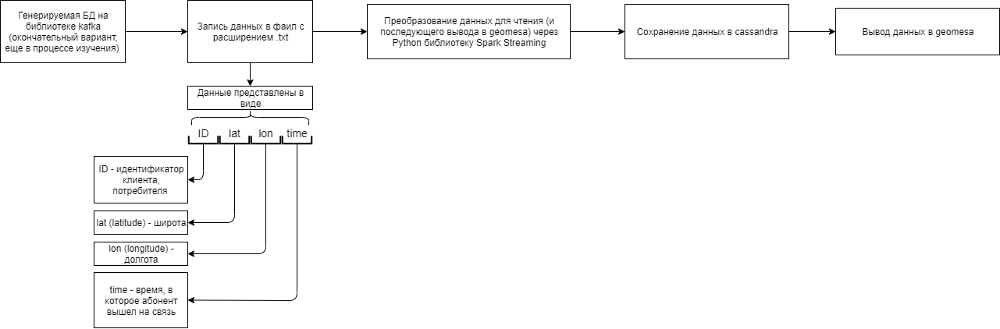

# Общая документация проекта

## **Цели:**

1 вариант: Реализовать механизм вычитывания данных о событиях с геопозицией, позволяющий доставать из БД данные по произвольному geo-полигону в некоторый промежуток времени.

2 вариант: Реализовать механизм , по запросу пользователя выдающий список пользователей  случайно генерируемой базы данных , которые в указанное время находятся в указанном GEO-полигоне.

## Общее описание проекта:

1. В Apache Kafka генерируем случайную базу данных неких пользователей ,в которую входят их ID , координаты их  местоположения ,включая долготу и широту и время выхода на связь.
2. В Spark реализуем механизм считывания данных о событиях с геопозицией из Kafka.
3. С помощью Spark Streamig полученные события  дедублицируем во временном окне в 10 минут.
4. Данное о geo-позиции пользователей обрабатываются с помощью geomesa + spark streamig и сохраняются в NoSQL базу данных по GeoHash индексу. В качестве NoSQL БД можно использовать Apache Cassandra
5. В результате получим возможность доставать из NoSQL БД данные по произвольному geo-полигону. А точнее, какие пользователи присутствовали в этом полигоне с 12:00 по 16:00

## Требования:

## Пожелания:

## Видение**:**

## Макет системы:

## **Правила и ограничения**:

---

## Дополнительная информация:

[Стейкхолдеры](Untitled/Untitled.md)

[Словарь терминов](Untitled/Untitled%201.md)

[Доступы к стендам и внешним системам](Untitled/Untitled%202.md)

[Версии проекта](Untitled/Untitled%203.md)