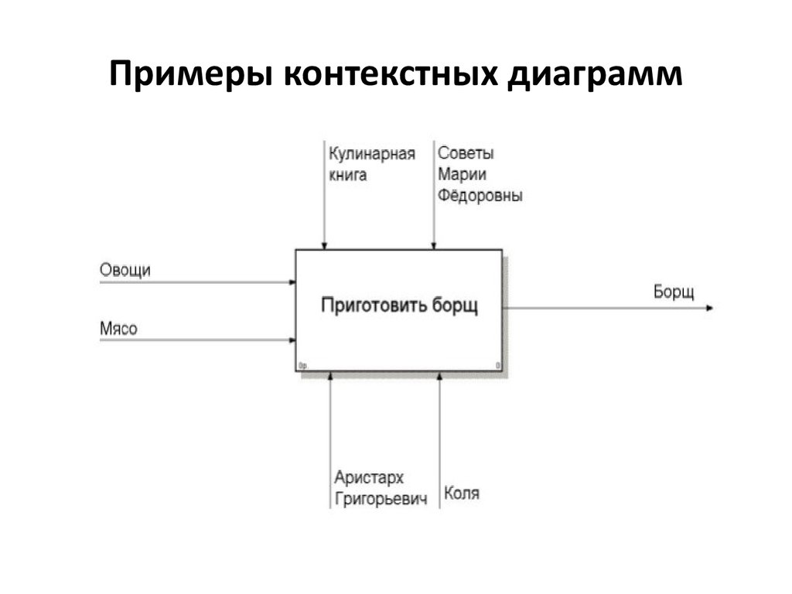

# Стейкхолдеры

Стейкхолдеры — физическое лицо или организация, имеющая права, долю, требования или интересы относительно системы или её свойств, удовлетворяющих их потребностям и ожиданиям. Таблица стейкхолдеров.

# Контекстная диаграмма

